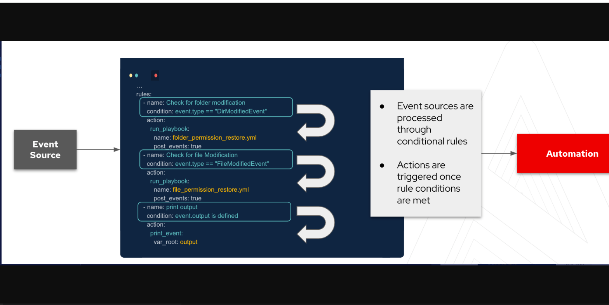

# ansible_eda_continuous_network_compliance
Files for EDA Network EDA Continuous Network Compliance Demo

## Getting started

The following links will explain how to install EDA and the other components used in the demo.

Optional Event-Driven CLI Ansible install:
Please note this code is the developer tech preview.
https://github.com/ansible/event-driven-ansible

EDA Controller GUI is part of a normal AAP install.
Try AAP for free: https://www.redhat.com/en/technologies/management/ansible/try-it
Developer License: https://developers.redhat.com/products/ansible/overview

Telegraf Collector Install
https://docs.influxdata.com/telegraf/v1.21/introduction/installation/
Please see this repo for my example telegraf.conf file.

Kafka Install
https://kafka.apache.org/quickstart

## Background for Event Driven Ansible
ansible-rulebook relies on a few components. These components all come together to allow you to respond to events and decide on the next course of action. The three main components to the rulebooks are as follows:

* Source - The sources of the events come from source plugins. These plugins define what    Event-Driven Ansible is listening to for events.
* Condition - The conditional statements in the rulebook allow us to match criteria on which one want to have some kind of response to.
* Action - Lastly, the action is the response once the condition has been met from the event source. This can be to trigger remediation, log a ticket for observation, or generate other events which would need responding to.

Currently, there are a number of source plugins however this list is being developed and as more partners get involved in the project the list will expand.

## Demo Rulebook
The rule book tells us that we are listening to a Kafka topic.
detect_config_change.yml

Source Plugin:
~~~
 sources:
    - ansible.eda.kafka:
        topic: telegraf
        host: ip-172-16-213-105.us-east-2.compute.internal
        port: 9092
        group_id:
~~~

The event we are looking for is for a configuration change applied to a remote Cisco router.
#### Rules:
~~~
rules:
   - name: When a Compliance Controlled Config Changes - Run Playbook
      condition: event.body.name == "Cisco-IOS-XE-native:native"
~~~
Lastly we have actions to launch a job-template to run the compliance_check.yml playbook with specific data passed as extra-variables from firing the rulebook.
#### Actions:
~~~
action:
        run_job_template:
          name: "EDA-Config-Check"
          organization: "Default"
          job_args:
            extra_vars:
              config: "{{ event.body.fields}}"
              _group: "{{ event.body.tags.source }}"      
~~~

## Demo Playbook
When ansible-rulebook works with a playbook, the event data is available to the playbook with the use of ansible_eda.event. Now, let's exit the current rulebook and lets take a look at the playbook compliance_check.yml

The extra-variables from the rulebook action define `_group`. Also note that the job-template used to manage this playbook requires prompt for extra-variables to be checked.
~~~
---
- name: Examine Configuration Changes For Compliance 
  hosts: "{{ _group }}"
  gather_facts: False
  vars: 
   save: no 
   ignore_all_errors: false

  tasks:

  - name: Grab Current Time
    set_fact: current_time="{{ lookup('pipe','date +%Y-%m-%d\ %H:%M:%S') }}"
~~~      
The ansible.builtin.set_fact module is used to define a new variable called `tag`. This variable will refine which role we will run based on the type of compliance check needed. The data `config` passed from the rulebook activation is evaluated by a loop and a dict2items filter. This filter enables the matching of dictionary keys to determine when they exist. If no key is matched the default is to run the `other` role.  
~~~
   - name: set_fact when stig in key
    ansible.builtin.set_fact:
      tag: stig-ios
    loop: "{{ config | ansible.builtin.dict2items }}"
    when: "'ip/Cisco_IOS_XE_http:http/server' in item.key or 'service/pad_conf/pad' in item.key or 'ip/bootp/server' in item.key"
   
  - name: set_fact when snmp in key
    ansible.builtin.set_fact:
      tag: snmp
    loop: "{{ config | ansible.builtin.dict2items }}"
    when: "'snmp' in item.key"

  - name: set_fact when logging in key
    ansible.builtin.set_fact:
      tag: logging
    loop: "{{ config | ansible.builtin.dict2items }}"
    when: "'logging' in item.key"

  - name: set_fact when ntp in key
    ansible.builtin.set_fact:
      tag: ntp
    loop: "{{ config | ansible.builtin.dict2items }}"
    when: "'ntp' in item.key"

  - name: Run Role for Compliance 
    ansible.builtin.include_role:
        name: "../roles/{{ tag | default ('other') }}"

~~~
## Variables
Each role includes tasks and variables. The variables serve as our source of truth (SSOT) for the compliance configuration. Below are the configurations for logging and a portion of STIG for IOS routers. 

#### Logging
~~~
 ---
# vars file for compliance
# IOS-XE Compliance
#Logging
logging_ios:
  buffered:
    severity: notifications
    size: 12000
  console:
    severity: critical
  facility: local5
  hosts:
  - hostname: 1.1.1.2
  - hostname: 1.1.1.3
  monitor:
    severity: warnings
  snmp_trap:
  - errors
  trap: errors
  userinfo: True  
~~~
#### STIG-IOS
~~~
---
# DISA STIG EXAMPLES FROM https://public.cyber.mil/stigs/downloads/

# R-215823 CISC-ND-000470
iosxeSTIG_stigrule_215823_Manage: True

iosxeSTIG_stigrule_215823_disable_bootp_server_Lines:
  - no ip bootp server
iosxeSTIG_stigrule_215823_disable_http_server_Lines:
  - no ip http server
iosxeSTIG_stigrule_215823_disable_service_pad_Lines:
  - no service pad
#### 
iosxeSTIG_stigrule_215823_disable_boot_network_Lines:
  - no boot network
iosxeSTIG_stigrule_215823_disable_boot_server_Lines:
  - no ip boot server
iosxeSTIG_stigrule_215823_disable_dns_server_Lines:
  - no ip dns server
iosxeSTIG_stigrule_215823_disable_identd_Lines:
  - no ip identd
iosxeSTIG_stigrule_215823_disable_finger_Lines:
  - no ip finger
iosxeSTIG_stigrule_215823_disable_rcmd_rcp_enable_Lines:
  - no ip rcmd rcp-enable
iosxeSTIG_stigrule_215823_disable_rcmd_rsh_enable_Lines:
  - no ip rcmd rsh-enable
iosxeSTIG_stigrule_215823_disable_tcp_small_servers_Lines:
  - no service tcp-small-servers
iosxeSTIG_stigrule_215823_disable_udp_small_servers_Lines:
  - no service udp-small-servers
iosxeSTIG_stigrule_215823_disable_service_finger_Lines:
  - no service finger
iosxeSTIG_stigrule_215823_disable_service_config_Lines:
  - no service config
~~~

## Roles
The logging role tasks/cisco.ios.ios.yml includes tasks to determine the current state of the configuration and to change `replaced` the configuration as needed. A Service Now ticket is only created if the state of the task is changed. Otherwise the configuration is now reconciled and the ticket was closed. Lastly, the notify parameter is used to list the affected devices in a handler.

#### Logging
~~~
---
- name: Check/Apply IOSXE logging configuration
  cisco.ios.ios_logging_global:
    config: "{{ logging_ios }}"   
    state: replaced
  notify: Logging compliance violation
  register: logging_diff

- ansible.builtin.debug:
    msg:
    - "current logging config"
    - "{{ logging_diff.before }}"
    - "replace commands (remediation)"
    - "{{ logging_diff.commands | default ('no diff found') }}"

- name: ' Create SNOW ticket for {{ inventory_hostname }} {{ interface }}'
  servicenow.itsm.incident:
    instance:
      host: "{{ SN_HOST }}"
      username: "{{ SN_USERNAME }}"
      password: "{{ SN_PASSWORD }}"
    state: new
    impact: high
    urgency: high
    caller: admin
    description: "{{inventory_hostname}} configuration changed at {{ current_time }}######## The current {{ tag }} configuration ###### {{ config }} ##### was remediated for compliance"
    short_description: "{{inventory_hostname}} was out of compliance for {{ tag }}"
  register: snow_var
  delegate_to: localhost
  when: logging_diff.changed

- name: Resolve ticket
  servicenow.itsm.incident:
    instance:
      host: "{{ SN_HOST }}"
      username: "{{ SN_USERNAME }}"
      password: "{{ SN_PASSWORD }}"
    number: "{{ snow_var.record.number }}"
    state: resolved
    close_code: "Solved (Permanently)"
    close_notes: "Problem appears fixed! ##### Config Replaced: {{ logging_diff.commands }}"
    short_description: "{{inventory_hostname}} has been remdiated for {{ tag }}"
  delegate_to: localhost
  when: logging_diff.changed

- name: Close ticket
  servicenow.itsm.incident:
    instance:
      host: "{{ SN_HOST }}"
      username: "{{ SN_USERNAME }}"
      password: "{{ SN_PASSWORD }}"
    close_code: "Solved (Permanently)"
    close_notes: "The incident is closed"
    state: closed
    number: "{{ snow_var.record.number }}"
    short_description: "{{inventory_hostname}} is now compliant"
  delegate_to: localhost
  when: logging_diff.changed

- name: Show incident number
  ansible.builtin.debug:
    msg:
      - "{{ SN_HOST }}"
      - "{{ snow_var.record.number }}"
  when: logging_diff.changed
~~~

#### STIG-IOS
The stig-ios role includes tasks to determine the current state of the configuration and to use the configure module to update the configuration as needed. A Service Now ticket is only created if the state of the task is changed. Otherwise the configuration is now reconciled and the ticket was closed. 

~~~
# R-215823 CISC-ND-000470
- name: stigrule_215823_disable_bootp_server
  ignore_errors: "{{ ignore_all_errors }}"
  notify: "save configuration"
  ios_config:
    defaults: yes
    lines: "{{ iosxeSTIG_stigrule_215823_disable_bootp_server_Lines }}"
  when:
    - iosxeSTIG_stigrule_215823_Manage
  register: iosxeSTIG_stigrule_215823_disable_bootp_server

# R-215823 CISC-ND-000470
- name: stigrule_215823_disable_http_server
  ignore_errors: "{{ ignore_all_errors }}"
  notify: "save configuration"
  ios_config:
    defaults: yes
    lines: "{{ iosxeSTIG_stigrule_215823_disable_http_server_Lines }}"
  when:
    - iosxeSTIG_stigrule_215823_Manage
  register: iosxeSTIG_stigrule_215823_disable_http_server

# R-215823 CISC-ND-000470
- name: stigrule_215823_disable_service_pad
  ignore_errors: "{{ ignore_all_errors }}"
  notify: "save configuration"
  ios_config:
    defaults: yes
    lines: "{{ iosxeSTIG_stigrule_215823_disable_service_pad_Lines }}"
  when:
    - iosxeSTIG_stigrule_215823_Manage
  register: iosxeSTIG_stigrule_215823_disable_service_pad

####Service Now Ticket
- name: Create SNOW ticket 
  servicenow.itsm.incident:
    instance:
      host: "{{ SN_HOST }}"
      username: "{{ SN_USERNAME }}"
      password: "{{ SN_PASSWORD }}"
    state: new
    impact: high
    urgency: high
    caller: admin
    description: "{{inventory_hostname}} configuration changed at {{ current_time }}######## The current {{ tag }} configuration ###### {{ config }} ##### was remediated for compliance"
    short_description: "{{inventory_hostname}} was out of compliance for {{ tag }}"
  register: snow_var
  delegate_to: localhost
  when: iosxeSTIG_stigrule_215823_disable_bootp_server.changed == true or iosxeSTIG_stigrule_215823_disable_http_server.changed == true or iosxeSTIG_stigrule_215823_disable_service_pad.changed == true
- debug:
    msg: "{{ response }}"
  when: iosxeSTIG_stigrule_215823_disable_bootp_server.changed == true or iosxeSTIG_stigrule_215823_disable_http_server.changed == true or iosxeSTIG_stigrule_215823_disable_service_pad.changed == true
- name: Resolve ticket
  servicenow.itsm.incident:
    instance:
      host: "{{ SN_HOST }}"
      username: "{{ SN_USERNAME }}"
      password: "{{ SN_PASSWORD }}"
    number: "{{ snow_var.record.number }}"
    state: resolved
    close_code: "Solved (Permanently)"
    close_notes: "Problem appears fixed! ##### Config Replaced: {{ response }}"
    short_description: "{{inventory_hostname}} has been remdiated for {{ tag }}"
  delegate_to: localhost
  when: iosxeSTIG_stigrule_215823_disable_bootp_server.changed == true or iosxeSTIG_stigrule_215823_disable_http_server.changed == true or iosxeSTIG_stigrule_215823_disable_service_pad.changed == true

- name: Close ticket
  servicenow.itsm.incident:
    instance:
      host: "{{ SN_HOST }}"
      username: "{{ SN_USERNAME }}"
      password: "{{ SN_PASSWORD }}"
    close_code: "Solved (Permanently)"
    close_notes: "The incident is closed"
    state: closed
    number: "{{ snow_var.record.number }}"
    short_description: "{{inventory_hostname}} is now compliant"
  delegate_to: localhost
  when: iosxeSTIG_stigrule_215823_disable_bootp_server.changed == true or iosxeSTIG_stigrule_215823_disable_http_server.changed == true or iosxeSTIG_stigrule_215823_disable_service_pad.changed == true
